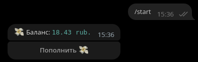
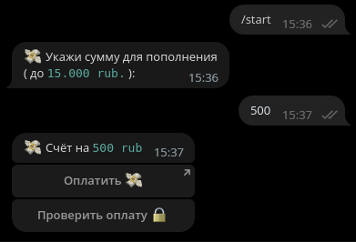
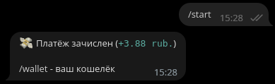

# YooMoneyWallet

Бот для тестирования подключения 
платёжной системы YooMoney.

# Запуск

Установи нужные библиотеки:
```bash
pip3 install aiogram
```

Установи `API_KEY` в `config.py`:
```python
# Config.py

API_KEY = '62843...fO70g'
```

Запусти бота (`run.py`):
```bash
cd TestPaymentsBot
```
```bash
python3 run.py
```

# Скриншоты





